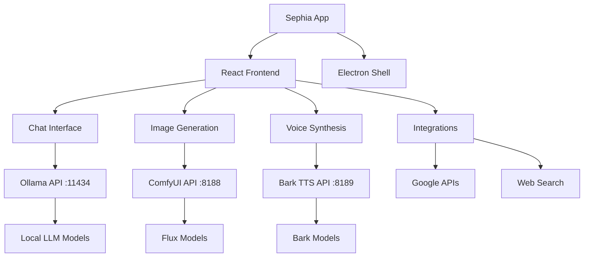

# 🧠⚡ Sephia - AI-Powered Local Assistant

> **The complete local AI workspace** - Chat with LLMs, generate images with Flux, and enjoy premium AI voices - all running privately on your machine.


## 🎯 One-Click AI Experience

**Just double-click the Sephia app and get:**
- 💬 **Local LLM Chat** - Private conversations with DeepSeek, Llama, and more
- 🎨 **Flux Image Generation** - High-quality AI images locally generated
- 🎤 **Premium AI Voices** - 10+ voice personalities with Bark TTS
- 🔗 **Smart Integrations** - Gmail, Google Drive, Calendar, and web search
- 📱 **One-Click Launch** - Everything starts automatically, no technical setup

---

## 🚀 Quick Start

### For End Users (Recommended)
1. **Download** the latest release from [GitHub Releases](https://github.com/alexandra767/React_LLM_GUI/releases)
2. **Double-click** `Sephia.command` 
3. **Wait 30 seconds** for all AI services to start
4. **Start chatting!** Everything works automatically

### For Developers
```bash
git clone https://github.com/alexandra767/React_LLM_GUI.git
cd React_LLM_GUI
npm install
./start-sephia.command
```

---

## ✨ Features Overview

### 💬 **Advanced Chat Interface**
- **Real-time streaming** with live token counting and response time
- **Auto-generating titles** from conversation content
- **Project organization** - group related chats together
- **Message management** - star, copy, delete, and search conversations
- **DeepSeek R1 thinking** - see the AI's reasoning process
- **Markdown support** with syntax highlighting and code blocks
- **Keyboard shortcuts** - ESC to interrupt, Enter to send

### 🎨 **Flux Image Generation**
- **High-quality AI images** generated locally with Flux.1-dev
- **Simple commands**: `@flux a sunset over mountains`
- **Step control**: `@flux:30 detailed portrait` (1-50 steps)
- **Quality enhancers** automatically applied
- **Progress tracking** with estimated completion time
- **M4 Mac optimized** for faster generation
- **Image-to-image** support via drag & drop

### 🎤 **Premium AI Voices (Bark TTS)**
- **10+ voice personalities**: Alex, Sarah, Mike, Emma, David, Lisa, James, Anna, Tom, Grace
- **Specialized voices**: Announcer, Narrator
- **High-quality synthesis** - sounds natural and expressive
- **Provider switching** - choose between browser TTS or AI voices
- **Local processing** - completely private, no cloud APIs
- **Automatic startup** - voice service launches with the app

### 🔗 **Smart Integrations**
- **Gmail**: `@gmail is:unread` - search and read emails
- **Google Drive**: `@drive presentation` - find and preview files
- **Calendar**: `@calendar 7` - view upcoming events (Google/Apple)
- **Web Search**: `@search weather today` - get current information
- **Apple Calendar** - native macOS calendar integration
- **Multi-account Google** - switch between Google accounts seamlessly

### 🤖 **Model Support**
- **Multiple LLM providers** via Ollama
- **Popular models**: DeepSeek R1, Llama, Mistral, CodeLlama
- **Model switching** - different models per project
- **Automatic detection** of installed models
- **M4 optimizations** for Apple Silicon Macs
- **Fallback handling** when models are unavailable

---

## 🏗️ **Architecture Overview**

### **Project Structure**
```
React_LLM_GUI/
├── 🚀 App Launchers
│   ├── Sephia.command              # Main app launcher (one-click)
│   └── start-sephia.command        # Development launcher
│
├── 🎨 Frontend (React + Electron)
│   ├── src/
│   │   ├── components/             # React components
│   │   │   ├── Chat/              # Chat interface components
│   │   │   │   ├── ChatInput.js   # Message input with @commands
│   │   │   │   ├── ChatView.js    # Main chat container
│   │   │   │   ├── Message.js     # Message display with markdown
│   │   │   │   ├── MessageList.js # Scrollable message container
│   │   │   │   ├── TokenDisplay.js # Live metrics display
│   │   │   │   └── ProgressBar.js # Image generation progress
│   │   │   ├── Layout/            # App layout components
│   │   │   │   ├── Header.js      # Top bar with model selector
│   │   │   │   ├── MainLayout.js  # Main app layout
│   │   │   │   └── Sidebar.js     # Navigation sidebar
│   │   │   ├── Projects/          # Project management
│   │   │   │   └── ProjectsView.js # Project cards and creation
│   │   │   ├── Settings/          # App configuration
│   │   │   │   └── SettingsView.js # API keys and preferences
│   │   │   └── Common/            # Shared components
│   │   │       └── ErrorBoundary.js # Error handling
│   │   ├── services/              # Core services
│   │   │   ├── LLMService.js      # Ollama LLM integration
│   │   │   ├── ImageGenerationService.js # Flux image generation
│   │   │   ├── VoiceService.js    # Voice synthesis management
│   │   │   ├── BarkVoiceService.js # Bark AI voice integration
│   │   │   ├── IntegrationService.js # Google/web integrations
│   │   │   └── ElectronIntegrationService.js # Electron-specific features
│   │   ├── context/               # State management
│   │   │   ├── AppContext.js      # Global app state
│   │   │   └── ThemeContext.js    # Theme management
│   │   └── utils/                 # Utility functions
│   │       ├── commandProcessor.js # @command parsing
│   │       ├── clipboard.js       # Copy/paste utilities
│   │       └── exportData.js      # Data export features
│   │
│   ├── electron/                  # Desktop app wrapper
│   │   ├── main.js               # Electron main process
│   │   └── preload.js           # Browser API bridge
│   │
│   └── public/                   # Static assets
│       ├── images/              # Icons and branding
│       └── index.html          # App entry point
│
├── 🤖 AI Services (Backend)
│   └── ai-tools/
│       └── ComfyUI/             # Image generation engine
│           ├── bark_tts_server.py    # Bark voice API server
│           ├── start-bark-tts.sh     # Voice service launcher
│           ├── start-comfyui-m4.sh   # Image service launcher
│           └── models/               # AI model files
│               ├── unet/            # Flux image models
│               ├── clip/            # Text encoders
│               ├── vae/             # Image decoders
│               └── checkpoints/     # Model checkpoints
│
├── 📦 Build & Deploy
│   ├── package.json             # Dependencies and scripts
│   ├── electron-builder-config.json # App packaging config
│   └── dist/                   # Built applications
│
└── 📚 Documentation
    ├── README.md               # This file
    ├── ICON_UPDATE_INSTRUCTIONS.md # Branding guide
    ├── M4_OPTIMIZATION_GUIDE.md    # Apple Silicon setup
    └── PR_DESCRIPTION.md           # Development notes
```

### **Service Architecture**



---

## 🎯 **Detailed Feature Guide**

### **💬 Chat Commands**

#### **Basic Chat**
```bash
# Regular conversation
Hello, how are you?

# Multi-line messages
Shift + Enter for new lines
```

#### **Image Generation**
```bash
# Basic image generation (12 steps, fast)
@flux a red apple

# Custom step count (1-50 steps)
@flux:20 a detailed portrait of a cat
@flux:30 a cyberpunk city at night    # High quality
@flux:8 quick sketch of a mountain    # Fast generation

# Image-to-image (drag image into chat first)
@flux transform this into a painting
```

#### **Voice & Audio**
```bash
# The app automatically speaks AI responses
# Switch voice provider in Settings → Voice
# Choose from 10+ AI voice personalities
```

#### **Integrations**
```bash
# Gmail search
@gmail is:unread                     # Unread emails
@gmail from:john@example.com         # Emails from specific sender
@gmail subject:"meeting"             # Search by subject

# Google Drive
@drive presentation                  # Find presentations
@drive modified:today               # Recently modified files
@drive                             # List recent files

# Calendar
@calendar                          # Next 7 days (Google)
@calendar 14                       # Next 14 days
@calendar 7 apple                  # Apple Calendar (macOS)

# Web Search
@search weather tomorrow            # Current information
@web latest news about AI          # Web search

# Help
@help                             # Show all commands
```

### **🎨 Image Generation Deep Dive**

#### **Quality Settings**
- **@flux** (12 steps) - Fast, good quality (~15 minutes)
- **@flux:20** (20 steps) - Balanced, better quality (~25 minutes)
- **@flux:30** (30 steps) - High quality, best results (~40 minutes)
- **@flux:50** (50 steps) - Maximum quality (~60 minutes)

#### **Automatic Quality Enhancers**
Every image prompt gets enhanced with:
```
, high quality, detailed, ultrarealistic photography, 8k resolution, 
masterpiece, best quality, extremely detailed, sharp focus, 
professional photography, cinematic lighting, photorealistic
```

#### **M4 Mac Optimizations**
- **Unified memory** - leverages shared GPU/CPU memory
- **Metal Performance Shaders** - accelerated operations
- **Optimized model loading** - faster startup times
- **Memory management** - prevents crashes on large models

### **🎤 Voice Synthesis Options**

#### **Available Voices**
| Voice ID | Name | Gender | Style | Best For |
|----------|------|--------|-------|-----------|
| `v2/en_speaker_0` | Alex | Male | Neutral | General use |
| `v2/en_speaker_1` | Sarah | Female | Friendly | Conversations |
| `v2/en_speaker_2` | Mike | Male | Professional | Business |
| `v2/en_speaker_3` | Emma | Female | Warm | Storytelling |
| `v2/en_speaker_4` | David | Male | Deep | Announcements |
| `v2/en_speaker_5` | Lisa | Female | Clear | Instructions |
| `v2/en_speaker_6` | James | Male | Calm | Meditation |
| `v2/en_speaker_7` | Anna | Female | Expressive | Entertainment |
| `v2/en_speaker_8` | Tom | Male | Energetic | Gaming |
| `v2/en_speaker_9` | Grace | Female | Soft | ASMR |
| `announcer` | Announcer | Male | Professional | Broadcasting |
| `narrator` | Narrator | Male | Story | Audiobooks |

#### **Voice Provider Switching**
1. Go to **Settings** → **Voice**
2. Choose **Provider**:
   - **Browser TTS** - Built-in system voices (fast, basic quality)
   - **Bark AI TTS** - Premium AI voices (slower, high quality)
3. Select **Voice** from available options
4. **Test** voice with sample text

### **🔗 Integration Setup**

#### **Google Services (Gmail, Drive, Calendar)**
1. Go to **Settings** → **API Keys & Integrations**
2. **Add Google Client ID** (required)
3. **Add Google Client Secret** (optional, for offline refresh)
4. **Sign in** when prompted for first use
5. **Grant permissions** for each service

#### **Apple Calendar (macOS only)**
1. Go to **Settings** → **Integrations** → **Apple Calendar**
2. **Enter Apple ID** (your iCloud email)
3. **Create App-Specific Password**:
   - Go to appleid.apple.com
   - Sign in → Security → App-Specific Passwords
   - Generate password for "Sephia"
4. **Enter password** in Sephia settings
5. **Test connection**

---

## 🛠️ **Installation & Setup**

### **System Requirements**
- **macOS 11+** (recommended), Windows 10+, or Linux
- **8GB RAM minimum** (16GB recommended for image generation)
- **20GB free space** (for AI models)
- **Internet connection** (for initial model downloads)

### **Prerequisites**
```bash
# Install Node.js 18+
brew install node

# Install Ollama
brew install ollama

# Start Ollama service
ollama serve

# Install a model (choose one)
ollama pull deepseek-r1:8b-m4     # Fast reasoning model (4GB)
ollama pull llama3.2:8b           # General purpose (4GB)
ollama pull mistral:7b            # Efficient model (3.8GB)
```

### **App Installation**

#### **Option 1: Pre-built App (Easiest)**
1. Download latest release from [GitHub Releases](https://github.com/alexandra767/React_LLM_GUI/releases)
2. Extract the downloaded file
3. Double-click `Sephia.command`
4. Wait for services to start (30-60 seconds)
5. Start chatting!

#### **Option 2: Development Setup**
```bash
# Clone repository
git clone https://github.com/alexandra767/React_LLM_GUI.git
cd React_LLM_GUI

# Install dependencies
npm install

# Start all services
./start-sephia.command
```

### **First Launch Process**
When you first start Sephia:

1. **Terminal opens** showing startup progress
2. **ComfyUI starts** (image generation service)
   - Downloads Flux models (~22GB) on first run
   - Shows "✅ ComfyUI is ready!" when loaded
3. **Bark TTS starts** (voice service)
   - Downloads voice models (~2GB) on first run
   - Loads 10+ voice personalities
4. **React app launches** (main interface)
   - Opens in Electron window
   - Connects to all services automatically
5. **Ready to use!** All AI features available

---

## 🎯 **Usage Examples**

### **Daily Workflow Examples**

#### **Content Creation**
```bash
# Generate blog post
Write a blog post about sustainable living

# Create matching image
@flux:25 a beautiful eco-friendly home with solar panels and garden

# Read it aloud with AI voice
# (Automatic - AI responses are spoken with your selected voice)
```

#### **Research & Communication**
```bash
# Search for recent information
@search latest developments in renewable energy 2024

# Check related emails
@gmail renewable energy OR sustainability

# Find relevant documents
@drive energy report OR sustainability

# Schedule follow-up
@calendar next week
```

#### **Creative Projects**
```bash
# Get creative ideas
Generate 5 unique story concepts for a sci-fi novel

# Visualize concepts
@flux:30 a futuristic cityscape with flying cars and neon lights
@flux:25 an alien planet with purple vegetation and twin moons

# Organize in project
# Create "Sci-Fi Novel" project to keep all related chats together
```

#### **Learning & Development**
```bash
# Learn new concept
Explain quantum computing in simple terms

# Get visual aid
@flux:20 diagram showing quantum bits vs classical bits

# Code example
Write a Python function to demonstrate quantum superposition

# Voice explanation
# Switch to "Emma (Warm)" voice for learning content
```

### **Advanced Command Combinations**

#### **Research Workflow**
```bash
# Step 1: Get current information
@search artificial intelligence trends 2024

# Step 2: Check your emails for related content
@gmail AI OR "artificial intelligence"

# Step 3: Find relevant documents
@drive AI research OR machine learning

# Step 4: Generate supporting visuals
@flux:25 modern AI datacenter with blue lighting and servers

# Step 5: Synthesize findings
Based on the search results, emails, and documents, create a comprehensive report on AI trends...
```

#### **Creative Content Pipeline**
```bash
# Brainstorm
Generate 10 creative product names for a smart home device

# Visualize concepts
@flux:30 sleek white smart home hub on modern kitchen counter

# Refine with variation
@flux:25 same device but in black with blue accent lighting

# Get feedback via integration
# Email the concepts to team with @gmail commands
```

---

## ⚙️ **Configuration & Customization**

### **Settings Overview**
Access via **Settings** icon in top-right corner:

#### **🤖 Model Settings**
- **Default Model** - Choose your preferred LLM
- **Model per Project** - Different models for different projects
- **Temperature** - Creativity level (0.1-2.0)
- **Max Tokens** - Response length limit

#### **🎤 Voice Settings**
- **Provider** - Browser TTS vs Bark AI TTS
- **Voice Selection** - Choose from available voices
- **Speaking Rate** - Speed of speech (0.5-2.0x)
- **Volume** - Voice volume level
- **Auto-speak** - Automatically read AI responses

#### **🎨 Image Generation**
- **Default Steps** - Quality vs speed preference (8-30)
- **Auto-enhance** - Add quality modifiers to prompts
- **Save Location** - Where to save generated images
- **M4 Optimizations** - Apple Silicon specific settings

#### **🔗 Integrations**
- **Google Services** - Client ID, Secret, Account switching
- **Apple Calendar** - Apple ID and app-specific password
- **Web Search** - Search engine preferences
- **API Keys** - Third-party service credentials

#### **🎨 Appearance**
- **Theme** - Dark mode (default), Light mode
- **Font Size** - Message text size
- **Sidebar Width** - Navigation panel width
- **Animation** - Enable/disable UI animations

### **Advanced Configuration**

#### **Custom Voice Setup**
```javascript
// Add custom voice to BarkVoiceService.js
const CUSTOM_VOICES = {
  "custom/my_voice": {
    name: "My Voice",
    language: "English", 
    gender: "Custom",
    style: "Personal"
  }
};
```

#### **Model Configuration**
```bash
# Add custom Ollama model
ollama pull custom-model:latest

# Configure in Sephia
# Model appears automatically in dropdown
```

#### **Flux Model Customization**
```bash
# Use different Flux model
cd ai-tools/ComfyUI/models/unet/
# Replace flux1-dev.safetensors with your preferred model
```

---

## 🔧 **Troubleshooting**

### **Common Issues & Solutions**

#### **🚨 App Won't Start**
```bash
# Check if ports are in use
lsof -i :3000  # React
lsof -i :8188  # ComfyUI  
lsof -i :8189  # Bark TTS
lsof -i :11434 # Ollama

# Kill conflicting processes
sudo killall -9 node
sudo killall -9 python

# Restart services
./start-sephia.command
```

#### **🚨 Ollama Connection Failed**
```bash
# Check Ollama status
ollama serve

# Test connection
curl http://localhost:11434/api/tags

# Install a model if none exist
ollama pull deepseek-r1:8b-m4

# Verify models
ollama list
```

#### **🚨 Image Generation Not Working**
```bash
# Check ComfyUI logs
tail -f /tmp/comfyui.log

# Verify Flux model exists
ls -la ai-tools/ComfyUI/models/unet/flux1-dev.safetensors

# Should be ~22GB, if smaller it's corrupted:
# Re-copy from backup or re-download
```

#### **🚨 Bark TTS Silent/Not Working**
```bash
# Check Bark TTS status
curl http://localhost:8189/status

# Check logs
tail -f /tmp/bark-tts.log

# Restart voice service
cd ai-tools/ComfyUI
./start-bark-tts.sh

# Test voice generation
curl -X POST http://localhost:8189/tts \
  -H "Content-Type: application/json" \
  -d '{"text": "Test", "voice": "v2/en_speaker_1"}'
```

#### **🚨 Google Integrations Not Working**
1. **Check API Keys**:
   - Settings → API Keys & Integrations
   - Verify Google Client ID is correct
   - Try re-entering credentials

2. **Clear Auth Cache**:
   ```bash
   # Clear stored tokens
   localStorage.removeItem('google_access_token')
   localStorage.removeItem('google_refresh_token')
   ```

3. **Check Permissions**:
   - Go to myaccount.google.com
   - Security → Third-party apps
   - Verify Sephia has necessary permissions

#### **🚨 Memory/Performance Issues**
```bash
# Check memory usage
top -o MEM

# Free up memory
sudo purge

# Restart with memory optimization
PYTORCH_MPS_HIGH_WATERMARK_RATIO=0.0 ./start-sephia.command
```

### **Debug Mode**
Enable detailed logging:
```bash
# Set debug environment
export DEBUG=true
export ELECTRON_ENABLE_LOGGING=true

# Start with verbose output
./start-sephia.command --verbose
```

### **Reset Everything**
If all else fails:
```bash
# Stop all services
pkill -f "comfyui"
pkill -f "bark"
pkill -f "ollama"

# Clear app data
rm -rf ~/.sephia
rm -rf /tmp/comfyui.log
rm -rf /tmp/bark-tts.log

# Restart
./start-sephia.command
```

---

## 🔒 **Privacy & Security**

### **Data Privacy**
- **100% Local Processing** - All AI runs on your machine
- **No Cloud APIs** - Your conversations never leave your device
- **Private Image Generation** - Flux models run locally
- **Secure Voice Synthesis** - Bark TTS processes audio locally
- **Optional Cloud Features** - Google integrations are opt-in only

### **Data Storage**
```
~/Library/Application Support/Sephia/    # macOS
%APPDATA%/Sephia/                        # Windows
~/.config/Sephia/                        # Linux

├── chats/          # Chat histories (encrypted)
├── projects/       # Project data
├── settings.json   # App preferences
├── models/         # Cached model data
└── temp/          # Temporary files
```

### **Network Usage**
- **Model Downloads** - Initial download of AI models (one-time)
- **Google APIs** - Only when using @gmail, @drive, @calendar commands
- **Web Search** - Only when using @search commands
- **Updates** - Optional app updates

### **Permissions**
- **Microphone** - For voice input (optional)
- **File System** - For saving images and exports
- **Network** - For model downloads and integrations
- **Notifications** - For completion alerts (optional)

---

## 🚀 **Building & Deployment**

### **Development Build**
```bash
# Install dependencies
npm install

# Start development server
npm start

# Start with Electron
npm run electron:dev

# Run all services
./start-sephia.command
```

### **Production Build**

#### **Web Build**
```bash
# Build React app
npm run build

# Serve locally
npm run serve
```

#### **Electron App Build**
```bash
# Build for current platform
npm run electron:build

# Build for specific platforms
npm run electron:build:mac     # macOS
npm run electron:build:win     # Windows  
npm run electron:build:linux   # Linux

# Build universal (Intel + Apple Silicon)
npm run electron:build:mac:universal
```

#### **App Packaging**
```bash
# Create distributable package
npm run package

# Create installer
npm run make

# Sign app (macOS)
npm run sign

# Notarize app (macOS)
npm run notarize
```

### **Release Process**
1. **Update version** in `package.json`
2. **Update changelog** in `README.md`
3. **Build all platforms**:
   ```bash
   npm run build:all
   ```
4. **Test packages** on different platforms
5. **Create GitHub release**:
   ```bash
   gh release create v1.x.x \
     dist/Sephia-1.x.x-mac.dmg \
     dist/Sephia-1.x.x-win.exe \
     dist/Sephia-1.x.x-linux.AppImage \
     --title "Sephia v1.x.x" \
     --notes "Release notes here"
   ```

### **CI/CD Pipeline**
```yaml
# .github/workflows/build.yml
name: Build and Release
on:
  push:
    tags: ['v*']
jobs:
  build:
    runs-on: ${{ matrix.os }}
    strategy:
      matrix:
        os: [macos-latest, windows-latest, ubuntu-latest]
    steps:
      - uses: actions/checkout@v3
      - uses: actions/setup-node@v3
      - run: npm install
      - run: npm run build
      - run: npm run electron:build
```

---

## 🤝 **Contributing**

### **Development Setup**
```bash
# Fork and clone
git clone https://github.com/[your-username]/React_LLM_GUI.git
cd React_LLM_GUI

# Install dependencies
npm install

# Create feature branch
git checkout -b feature/your-feature

# Start development
./start-sephia.command
```

### **Code Style**
- **ESLint** - Follow existing linting rules
- **Prettier** - Code formatting (run `npm run format`)
- **JSDoc** - Document complex functions
- **React patterns** - Use hooks and functional components
- **Error handling** - Comprehensive try/catch blocks

### **Testing**
```bash
# Run tests
npm test

# Run with coverage
npm run test:coverage

# E2E tests
npm run test:e2e

# Test specific component
npm test -- --testNamePattern="ChatInput"
```

### **Pull Request Process**
1. **Create feature branch** from `main`
2. **Make changes** with clear commit messages
3. **Add tests** for new functionality
4. **Update documentation** as needed
5. **Test on multiple platforms**
6. **Submit PR** with detailed description

### **Areas for Contribution**
- 🐛 **Bug fixes** - Fix issues and improve stability
- ✨ **New features** - Add integrations or UI improvements
- 🎨 **UI/UX** - Design improvements and accessibility
- 📚 **Documentation** - Improve guides and examples
- 🧪 **Testing** - Add test coverage
- 🌐 **Localization** - Multi-language support
- 🔧 **Performance** - Optimization and efficiency

---

## 📚 **API Documentation**

### **Core Services**

#### **LLMService**
```javascript
import LLMService from './services/LLMService';

// Send message to LLM
const response = await LLMService.sendMessage({
  message: "Hello, AI!",
  model: "deepseek-r1:8b-m4",
  temperature: 0.7,
  onProgress: (chunk) => console.log(chunk)
});
```

#### **ImageGenerationService**
```javascript
import ImageGenerationService from './services/ImageGenerationService';

// Generate image with Flux
const image = await ImageGenerationService.generateImage(
  "a beautiful sunset over mountains",
  {
    steps: 20,
    width: 768,
    height: 768,
    onProgress: (progress) => console.log(progress)
  }
);
```

#### **BarkVoiceService**
```javascript
import BarkVoiceService from './services/BarkVoiceService';

// Speak text with AI voice
await BarkVoiceService.speak("Hello, this is AI speech!", {
  voice: "v2/en_speaker_1",
  temperature: 0.7
});

// Get available voices
const voices = await BarkVoiceService.getVoices();
```

### **Command System**
```javascript
import { processCommand } from './utils/commandProcessor';

// Process @ commands
const result = await processCommand("@flux a red apple", [], {
  setImageGenerationProgress: (progress) => console.log(progress)
});

// Command types
// result.type: 'image' | 'integration' | 'error' | 'help'
// result.content: string
// result.imageUrl?: string
```

### **Integration APIs**

#### **Google Services**
```javascript
import IntegrationService from './services/IntegrationService';

// Search Gmail
const emails = await IntegrationService.searchGmail("is:unread");

// List Drive files
const files = await IntegrationService.listGoogleDriveFiles("presentation");

// Get Calendar events
const events = await IntegrationService.getGoogleCalendarEvents(
  new Date(),
  new Date(Date.now() + 7 * 24 * 60 * 60 * 1000)
);
```

---

## 🎯 **Roadmap & Future Features**

### **🔜 Next Release (v3.0)**
- [ ] **Real-time voice chat** - Speak directly with AI
- [ ] **Image understanding** - Upload images for AI analysis
- [ ] **Document analysis** - PDF, Word, Excel support
- [ ] **Plugin system** - Third-party extensions
- [ ] **Cloud sync** - Optional backup and sync
- [ ] **Mobile app** - iOS and Android versions

### **🔮 Future Vision**
- [ ] **Multi-modal AI** - Text, voice, image, video
- [ ] **Collaborative workspaces** - Team projects
- [ ] **AI agents** - Autonomous task completion
- [ ] **Custom model training** - Personal AI assistants
- [ ] **AR/VR integration** - Spatial computing interface
- [ ] **IoT integration** - Smart home control

### **🤖 AI Enhancements**
- [ ] **Model fine-tuning** - Personalized responses
- [ ] **Knowledge graphs** - Contextual understanding
- [ ] **Memory systems** - Long-term conversation memory
- [ ] **Reasoning chains** - Multi-step problem solving
- [ ] **Code execution** - Safe code running environment

---

## 🏆 **Acknowledgments**

### **AI Technologies**
- **[Ollama](https://ollama.ai/)** - Local LLM hosting and management
- **[Stability AI](https://stability.ai/)** - Flux.1 image generation models
- **[Suno AI](https://suno.ai/)** - Bark text-to-speech models
- **[DeepSeek](https://deepseek.ai/)** - R1 reasoning models
- **[Meta](https://ai.meta.com/)** - Llama language models

### **Frameworks & Libraries**
- **[React](https://react.dev/)** - UI framework
- **[Electron](https://electronjs.org/)** - Desktop app framework
- **[FastAPI](https://fastapi.tiangolo.com/)** - AI service APIs
- **[ComfyUI](https://github.com/comfyanonymous/ComfyUI)** - Image generation backend
- **[Material-UI](https://mui.com/)** - Component library

### **Development Tools**
- **[Anthropic Claude](https://anthropic.com/)** - AI development assistance
- **[GitHub](https://github.com/)** - Version control and hosting
- **[npm](https://npmjs.com/)** - Package management
- **[Node.js](https://nodejs.org/)** - Runtime environment

### **Community**
- All beta testers and early adopters
- Contributors who submitted issues and PRs
- The open-source AI community
- Stack Overflow and developer forums

---

## 📞 **Support & Contact**

### **Getting Help**
1. **Check this README** - Most answers are here
2. **Search Issues** - [GitHub Issues](https://github.com/alexandra767/React_LLM_GUI/issues)
3. **Create Issue** - Report bugs or request features
4. **Discussions** - [GitHub Discussions](https://github.com/alexandra767/React_LLM_GUI/discussions)

### **Bug Reports**
When reporting bugs, please include:
- **System info** - OS, version, hardware specs
- **Steps to reproduce** - Exact actions taken
- **Expected behavior** - What should happen
- **Actual behavior** - What actually happened
- **Console logs** - Any error messages
- **Screenshots** - If applicable

### **Feature Requests**
For new features:
- **Use case** - Why is this needed?
- **Implementation** - How should it work?
- **Alternatives** - Other solutions considered?
- **Impact** - Who would benefit?

### **Contact**
- **GitHub**: [@alexandra767](https://github.com/alexandra767)
- **Email**: [project email]
- **Website**: [project website]

---

## 📄 **License**

This project is licensed under the **MIT License** - see the [LICENSE](LICENSE) file for details.

### **Third-Party Licenses**
- **Ollama** - Apache 2.0 License
- **ComfyUI** - GPL-3.0 License
- **Bark TTS** - MIT License
- **React** - MIT License
- **Electron** - MIT License

---

## 🎉 **Thank You**

Thank you for using Sephia! This project represents hundreds of hours of development to create the ultimate local AI experience. If you find it valuable:

- ⭐ **Star the repository** on GitHub
- 🐛 **Report bugs** to help improve it
- 💡 **Suggest features** for future releases
- 🤝 **Contribute code** to make it better
- 🗣️ **Share with others** who might benefit

---

<div align="center">

**🧠⚡ Built with ❤️ by Alexandra**

*Empowering everyone with private, powerful AI*

[](https://github.com/alexandra767/React_LLM_GUI/stargazers)
[](https://github.com/alexandra767/React_LLM_GUI/network/members)
[](https://github.com/alexandra767/React_LLM_GUI/issues)
[](https://opensource.org/licenses/MIT)

</div>